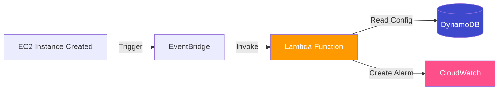

# Alarm Gen

The goal of the project is to automatically create Cloudwatch Alarms for important metrics for EC2 instances when they are created with a specific tag `env`: `prod`. Here is the architecture.

1. Eventbridge event is triggered whenever a resource is created.

2. EB then triggers a lambda function

3. The lambda function fetches the alarm configuration for ec2 from dynamodb and creates the alarms

